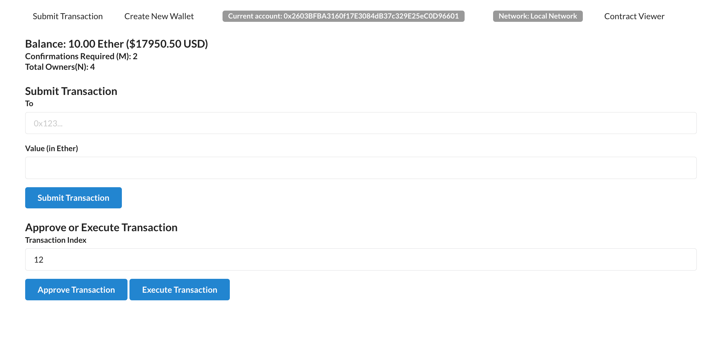

## MultiSig Wallet Web Application
This is a web application for interacting with a MultiSig wallet smart contract on the Ethereum blockchain. The MultiSig wallet allows multiple owners to manage funds and requires a specified number of confirmations from owners before executing transactions.

## Functionality
Submit Transaction: Owners can submit a transaction by providing the recipient's address, the amount in Ether
Confirm Transaction: Owners can confirm pending transactions to reach the required number of confirmations.
Execute Transaction: Owners can execute a confirmed transaction, transferring the specified amount to the recipient.
View Transactions: Using contract viewer users can view transaction details, including the transaction status and confirmation count.

## How to Run the Application
Follow the steps below to run the MultiSig wallet web application:

#### Clone the repository to your local machine.
Install the required dependencies by running npm install in the project directory.
Make sure you have a compatible Ethereum provider or node available (e.g., Ganache).
Start the application by running npm start in the project directory.
Open your web browser and navigate to http://localhost:3000 to access the MultiSig wallet web application.
Note: Ensure that you have MetaMask or a compatible Ethereum wallet extension installed in your browser and connected to the desired network (e.g., Local, Mainnet, Ropsten, Rinkeby) to interact with the MultiSig wallet on the Ethereum blockchain.

#### Dependencies
The MultiSig wallet web application relies on the following major dependencies:

React: JavaScript library for building user interfaces.
Web3.js: Ethereum library for interacting with the Ethereum blockchain.
Semantic UI React: Component library for creating stylish user interfaces.
react-router-dom: Library for handling routing within the React application.
Compatibility

#### License
This application is released under the MIT License. Feel free to modify and distribute the application according to the terms of the license.

